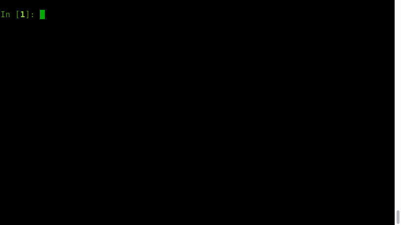
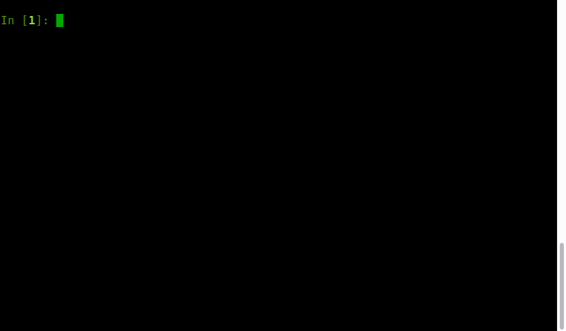

[](https://travis-ci.org/ryukinix/decorating)
[](https://codecov.io/gh/ryukinix/decorating)
[](https://requires.io/github/ryukinix/decorating/requirements/?branch=master)
[](https://pypi.python.org/pypi/decorating/)
[](https://pypi.python.org/pypi/decorating/)
[](https://pypi.python.org/pypi/decorating/)

## Description

[decorating](https://github.com/ryukinix/decorating) encourages an exploration into the limits of decorators in `Python`. While decorators might by new to beginners, they are an extremely useful feature of the language. They can be similar to Lisp Macros, but without changes to the AST, actually only work like "Wrapper Macros". Great decorator examples are `@animated` and `@writing` on this project. This repository is made from scratch, just using Python's Standard Library, so then no any dependency!


## Showcase





## Decorators of Decorating

### decorating.debug

Print in a nicely way a output/input of a function call.

```python
import decorating

@decorating.debug
def fib(n):
    if n < 2:
        return n
    else:
        return fib(n - 1) + fib(n - 2)

print("Result: {}".format(fib(3)))
# OUTPUT:
# fib(1) -> 1
# @fib(0) -> 0
# @fib(2) -> 1
# @fib(1) -> 1
# @fib(3) -> 2
# Result: 2
```


### decorating.cache

Memoize the function decorated based on their arguments.

```python
import decorating

@decorating.debug
@decorating.cache
def fib(n):
    if n < 2:
        return n
    else:
        return fib(n - 1) + fib(n - 2)

print("Result: {}".format(fib(30)))

# OUTPUT:
# @fib(1) -> 1
# @fib(0) -> 0
# @fib(2) -> 1
# @fib(1) -> 1
# @fib(3) -> 2
# @fib(2) -> 1
# @fib(4) -> 3
# @fib(3) -> 2
# @fib(5) -> 5
# ... many calls! (erased)
# @fib(23) -> 28657
# @fib(25) -> 75025
# @fib(24) -> 46368
# @fib(26) -> 121393
# @fib(25) -> 75025
# @fib(27) -> 196418
# @fib(26) -> 121393
# @fib(28) -> 317811
# @fib(27) -> 196418
# @fib(29) -> 514229
# @fib(28) -> 317811
# @fib(30) -> 832040
# Result: 832040
```

Nicely! We write a awful `O(2^n)` function that takes `O(n)` on time and space! Beautiful.

### decorating.counter

Return as side-effect a print on stdout about the time of calls of a function. On terminal this is overwritten

using a `\r` carriage character. Sometimes is usefull to see a high frequent function is used on some algorithm.

```python
import decorating

@decorating.counter
def f():
    pass

for i in range(10):
    f()

# OUTPUT:
# f has been used: 1x
# f has been used: 2x
# f has been used: 3x
# f has been used: 4x
# f has been used: 5x
# f has been used: 6x
# f has been used: 7x
# f has been used: 8x
# f has been used: 9x
# f has been used: 10x
```

### **decorating.count_time**

Calculate the time a function leaves to return a value after called.

```python
import decorating
import time

@decorating.count_time
def f():
    time.sleep(3)

f()

# OUTPUT:
# 'f' func leave it 3.00 s to finish
```

### decorating.animated

Make a cool animated bar using a on-side thread while the function is evaluated or the `with` block (context manager) is running. Useful to make human-friendly application whose some parts are slow and non-determinist sufficiently to do a progress bar. (like a socket listen, a process calculation and etc).

```python
import decorating
import time

with decorating.animated:
	time.sleep(3)

# animation is running ~ until the context managers exists
```

#### decorating.writing

This decorator is used to intercept every stdout print using a delayed printer. It's some like a human-type or a old computer. Check a partial implementation this on a non-released version of [MAL](https://asciinema.org/a/ctt1rozymvsqmeipc1zrqhsxb) on asciicinema.

```python
import decorating

with decorating.writing:
	print("YES! THIS IS WILL BE DELAYED.")
```


## Give a Try

`pip install decorating` # stable

`pip install git+https://github.com/ryukinix/decorating` # new features
