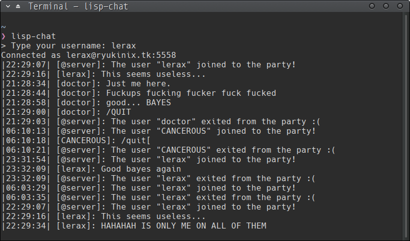

## Description

I did this as a exercise after read all Land of Lisp book. By other hand, I did that because was too bored — I don't know if this matters. But, anyway, just another minimal simple chat over TCP sockets without any smart solid protocol (like IRC). It is just raw data from client-to-server and the server broadcast the message for all clients connected.

The whole idea is very simple. The software is separated by `client.lisp` and `server.lisp`. While `server.lisp` is running it listen connections from a specified port (example: 5558) for the clients. In another hand, `client.lisp`, well... connects at the server and let the user send messages to it. All the messages send to `server.lisp` when is received, the server do a broadcast to each all the clients connected. Is just like a IRC of a unique room.

Seems very stupid, I know, but actually, because the implementation is so simple, we can give a specie of value on this. BTW, this post was the my first front-end on [Hacker News](https://news.ycombinator.com/item?id=13857880) with 114 points. I really didn't expect something like that when I wrote. So, well, this seems has some beauty. Maybe the reason is: software written in Lisp? (HAHAHA)

The system, client and server, is implemented using SBCL (Common Lisp Compiler) and USOCKET (TCP/UDP sockets). Just that. Cool, huh?

## Showcase

Yes. Only me. Actually on the HN trend day some people clone the project, setup the project and ran it. I just see the log later. HAHAH some guys typing things like `(quit)` or `ls`. Very funny. Actually the servers supports three commands non-documented: `/users`, `/help` and `/log`. But don't tell it to anyone.

Ps.: yes after the `22:29:16` I typed `/log` and old messages comeback.

## Source
You can look to the source here on [github](https://github.com/ryukinix/lisp-chat)
The minimal instructions to build and setup the project is written on README.md. At least for now, the day I wrote this post a server instance is running at `server.lerax.me:5558`. As alternative I provide too, for non-lispers, a simple Python client too. Both clients and the servers are configured to running at `server.lerax.me:5558`.
